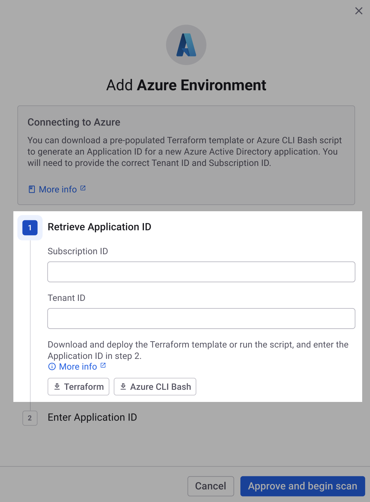

# Step 1: Download Azure app registration IaC template or script (Web UI)

Before you can create a Cloud Environment for an Azure subscription, you must **download** a Terraform infrastructure as code (IaC) template or Azure CLI Bash script declaring the following resources:

* [An Active Directory (AD) application registration](https://learn.microsoft.com/en-us/azure/active-directory/develop/app-objects-and-service-principals#application-registration)
* [A federated identity credential](https://learn.microsoft.com/en-us/azure/active-directory/develop/workload-identity-federation)
* [A service principal](https://learn.microsoft.com/en-us/azure/active-directory/develop/app-objects-and-service-principals#service-principal-object)

This infrastructure gives Snyk read-only permission to scan the configuration of resources in your subscription.

You will use the IaC template or Bash script you downloaded to **provision** the infrastructure in [Step 2: Create the Azure AD application](step-2-create-the-azure-ad-app-registration.md).

Both methods create the same infrastructure, so pick the method you are most comfortable working with.

## Download the IaC template or Bash script

1. In the [Snyk Web UI](https://app.snyk.io/), navigate to **Integrations > Cloud platforms**.
2. Select **Azure**.
3. In the **Add Azure Environment** modal, in the **Retrieve Application ID** section, enter the subscription ID and tenant ID of the subscription you want to onboard. You can find the IDs using the method [described in the Azure documentation](https://learn.microsoft.com/en-us/azure/azure-portal/get-subscription-tenant-id).
4. Select the **Terraform** button to download a `snyk-permissions-azure.tf` file or **Azure CLI Bash** to download a `snyk-permissions-azure.sh` file:\
   

You can now proceed to [Step 2: Create the Azure AD app registration](step-2-create-the-azure-ad-app-registration.md).


You can also add a Cloud environment from **Organization Settings (cog icon) > Cloud environments**. See [View Environments](../../../../scan-infrastructure/introduction-to-iac+/snyk-environments/view-add-and-remove-environments.md).


## What's next?

You can now proceed to [Step 2: Create the Azure AD app registration](step-2-create-the-azure-ad-app-registration.md).
