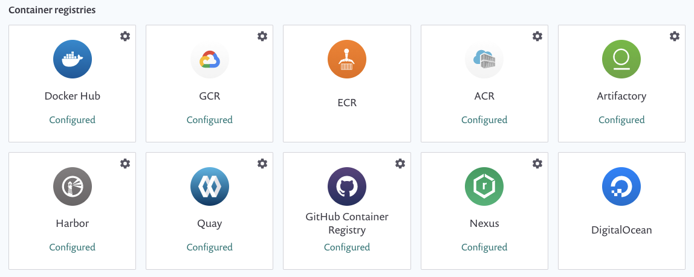

# Container security with Nexus integration


**Feature availability**\
This feature is available with Enterprise plans. See [pricing plans](https://snyk.io/plans/) for more details.


Snyk integrates with Nexus Container Registry to enable you to import your container images and monitor them for vulnerabilities.

Snyk tests the images you’ve imported (referred to as \`projects\`) for any known security vulnerabilities, testing them at a frequency you control and alerts you when new issues are detected.

To set up Nexus integration in Snyk and start managing image vulnerabilities:

## Prerequisites for Nexus integration

* You must be an administrator for the organization you're configuring in Snyk.
* Snyk needs user credentials to integrate with Nexus and does not support Nexus when configured for single sign-on (SSO).

## **Configure Nexus integration**

* In your Snyk account, navigate to **Integrations** from the menu bar at the top. **\*\*Under the** Container Registries **section, find the** Nexus\*\* option and click it.
* In the **Account credentials** section, enter your Nexus username and password login credentials. In the **container registry name** fill in the full URL to the registry you want to integrate with. To finish, click **Save**.

If you are using a self-hosted Nexus registry, [contact our Support team](https://support.snyk.io/hc/en-us/requests/new) to provide you with a token. You can read more about setting up private registry integration [here](https://docs.snyk.io/snyk-container/integrate-self-hosted-container-registries/snyk-integration-to-self-hosted-container-registries).

Snyk tests the connection values and the page reloads, now displaying Nexus integration information, and the **Add your Nexus images to Snyk** button becomes available. In case the connection to Nexus failed, notification appears under the **Connected to Nexus** section.

Now you can use Snyk to scan your images from Nexus.

Snyk tests and monitors your Nexus container images by evaluating its tags in your repositories. Once imported to Snyk, your image vulnerabilities are surfaced and can be triaged easily.

To add images from Nexus to Snyk:

## **Prerequisites for scanning container images from Nexus in Snyk**

* Have a Snyk account with access to the relevant organization (given by an administrator).
* Nexus integration configured. To learn more about that, follow the steps in [Container security with Nexus integration](https://docs.snyk.io/snyk-container/image-scanning-library/nexus-image-scanning/container-security-with-nexus-integration)

## **Steps for scanning container images from Nexus in Snyk**

1. Log in to your account and navigate to the relevant group and organization that you want to manage.
2. Under the **Projects** tab, click **Add project**. The list of integrations already configured on your account opens. Select the **Nexus** option or **Other** if Nexus doesn’t appear.
3. The **Which images do you want to test?** view appears, displaying all of the available images for your connected registry, grouped by each of your repositories.
4. Select single or multiple images to be imported to Snyk. Selection can be done by choosing a specific image or selecting an entire repository. You can also search by image name to find specific images to import. To finish, click **Add selected repositories** on the top-right.
5. A status bar appears at the top of the page as the images are imported; you can continue working in the meantime.
6. When the import ends:
   1. You can view the newly imported image in the **Projects** page (marked with a **NEW** tag). Images are grouped by repository and are each linked individually to a detailed **Project** page.
      1. An **import log** becomes available and can be reached at the top of the projects list.
   2. To enrich the data and get recommendations regarding your base image, you can connect your Dockerfile to the image project, under **Settings**. For more info, see [Adding your Dockerfile and test your base image](https://support.snyk.io/hc/articles/360003916218#UUID-9ab347a6-8af0-ef6c-5ebd-cec21fbfab29).

Nexus imports are indicated with a unique icon , and you can also filter to view only the Nexus projects:


For **application** vulnerabilities within container images, any changes to the application will not be reflected with a manual or recurring retest. A re-import of the image is required. See [Detecting application vulnerabilities in container images ](../../scan-containers/using-snyk-container/detecting-application-vulnerabilities-in-container-images.md)for more information.

