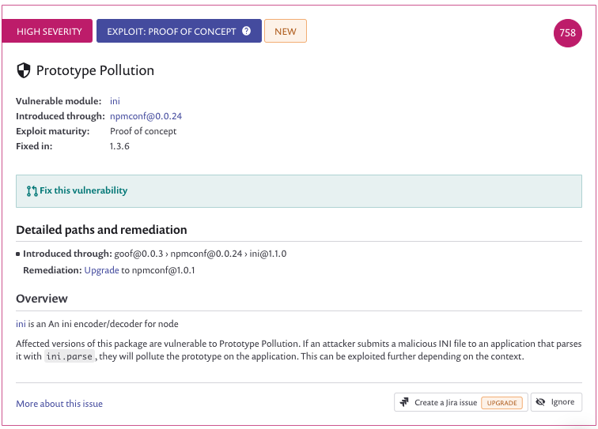

# View Project issues, fixes, and dependencies

The following Project information is available on the Snyk Web UI:

* **Issues:** the number of vulnerabilities and license issues
* **Fixes**: fix advice
* **Dependencies**: the total number of direct and transitive (nested) dependencies

## View issues

The Project details page displays Issue cards on the Issues tab. The information provided includes vulnerabilities and, for Open Source Project, license issues.

<figure><figcaption>
Project details Issues tab and filters
</figcaption></figure>

Use the filters in the panel to the left to narrow the search for issues. Select the checkboxes to filter issues by **Issue type**, **Severity**, **Exploit Maturity**, **Fixability**, and **Status**. You can also edit the **Priority Score** slider to change the range displayed; the default is 0 to 1000.

Issue details are shown on Issue cards in the main area, sorted by priority score. For details see [Issue card information](issue-card-information.md).

## Fix issues (Fix PR)

Snyk provides powerful features to fix issues identified during scanning. Use the Fix option on the Issues or Fixes tab.

<figure><figcaption>
Fix option on Fixes tab
</figcaption></figure>

You can also select **Fix this vulnerability** for a specific issue:

<figure><figcaption>
Fix this vulnerability for an issue
</figcaption></figure>

See [Fix vulnerabilities with Snyk Open Source](../../products/snyk-open-source/open-source-basics/) for an overview.\
See [Manage issues](../) for more details.

## View issue details

For each issue, details about the vulnerability are displayed including its [priority score](../issue-management/priority-score.md).

Click **More about this issue** to view detailed information about the vulnerability from [Snyk's vulnerability database](https://snyk.io/product/vulnerability-database/), which provides a deeper insight into the issue, including its CVSS score:

<figure><figcaption>
More information from Snyk Vulnerability database
</figcaption></figure>

## View fixes

Snyk's knowledge of the transitive dependencies in your Project make it possible for Snyk to offer fix advice, in the **Fixes** tab:

<figure><figcaption>
Issue details Fixes tab
</figcaption></figure>

See [Fix your vulnerabilities](../starting-to-fix-vulnerabilities/fix-your-vulnerabilities.md) for details.

## View dependencies

Snyk uses the package manager for your application to build the dependency tree and display it in the **Dependencies** tab of the Project issues detail page. This tab shows which components introduce a vulnerability, which indicates how the dependency was introduced to the application.

The example that follows shows a vulnerability based on the transitive dependency **qs@2.2.4**, brought in from the direct dependency **body-parser@ 1.9.0**.

<figure><figcaption>
Issues detail page dependencies tab
</figcaption></figure>
