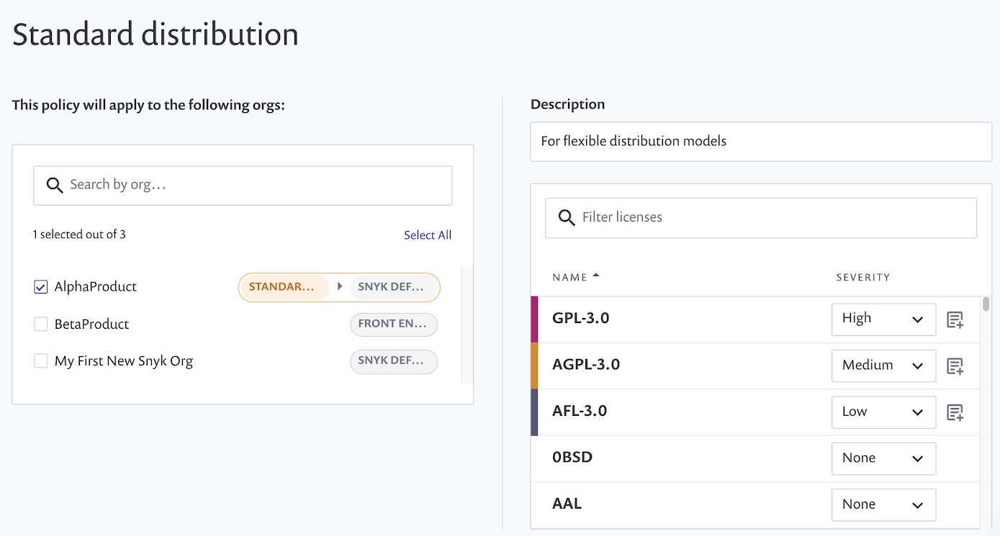

# Getting Started with Snyk License Compliance Management


**Feature availability**\
This feature is available with Enterprise plans. See [pricing plans](https://snyk.io/plans/) for more details.


Get started with Snyk license compliance management, to check compliance for the [open source licenses](https://snyk.io/learn/open-source-licenses/) in your code, as part of your [Snyk Open Source](https://docs.snyk.io/snyk-open-source/open-source-basics) solution.

The Snyk Default License Policy defines how Snyk identifies potential license issues in the open source packages your projects are using. The default policy applies to all organizations created within your group.


This process describes how to use the Snyk Web UI and a [supported source code management](https://support.snyk.io/hc/en-us/sections/360001138098-Git-repository-SCM-integrations) system.\
You can also use an [IDE tool](https://docs.snyk.io/integrations/ide-tools) or a [CI/CD integration](https://docs.snyk.io/integrations/ci-cd-integrations), or use the [Snyk CLI tool](https://docs.snyk.io/snyk-cli/guides-for-our-cli/getting-started-with-the-cli) to get started using the command line.


## **Prerequisites**

Ensure you have:

* A Snyk [paid plan](https://snyk.io/plans/).
* Integrated and installed your projects, as described for [Snyk Open Source](https://docs.snyk.io/getting-started/getting-started-snyk-products/getting-started-snyk-open-source).

## **Stage 1: Define policies**

To take effective action based on license issues, you need to define policies defining these actions, based on license types. Policies provide a way to capture different requirements within an organization, based on factors such as line of business. Work with your legal team to create policies that are specific to your company.

To open your Snyk Group default license policy, complete the following steps:

1. From your Snyk Organization, **Switch group** and select the relevant Group Overview.
2. Select the **Policies** tab.

### Create policy rules

Each policy contains rules, detailing which licenses are acceptable and which are forbidden for use, together with a severity level that indicates how severe the license violation is. For example, severity levels for internal-only license issues may be less severe than for those released externally.

To define your group license policy, complete the following steps:

1. Select **Snyk Default License Policy**.
2. Enter a **Description** for the policy to summarize what it does and the reason it was added.
3. For each license listed on the right, choose a **Severity** from the menu list to define which license issues you want to identify when Snyk tests run.
4. If you select a severity other than **None**, and you want to include additional instructions that will display when that license issue is identified, select the icon to the right of the Severity dropdown and enter the text for the license instruction.
5. Click **Add** or **Update** to confirm your changes.

The additional instructions show in the Snyk Web UI and the CLI when the selected licenses are identified.

See [Licenses overview](https://docs.snyk.io/snyk-open-source/licenses) and [Setting a license policy](https://docs.snyk.io/snyk-open-source/license-policies/setting-a-license-policy).

## Stage 2: View issues

Snyk’s [Git-based integrations ](https://docs.snyk.io/integrations/git-repository-scm-integrations)support license scanning as part of the regular workflow. During scanning, license issues appear as a filterable list in the **Issues** tab:

 (1).png>)

This example shows a high-severity issue for a GPL-2.0 license, with accompanying instructions as defined in the policies for that license.

You can also view license issues using the Snyk CLI tool, after running **snyk test**:

**View dependencies**

Snyk shows license issues in both your direct and transitive dependencies, in a full dependency tree to show what dependency introduced the license issue.

.png>)

This example includes two high severity license policy violations, caused by:

* a direct dependency on an npm package called **wicket@1.3.5**
* a transitive dependency on a package called **flickity@2.2.1** introduced by **web-project-starter@0.0.3**

**View lists and copyrights**

You can view and share detailed lists of licenses being used, and see a report that lists all the Open Source components and licenses along with copyright information.

## **Stage 3: Process issues**

You can now take action to resolve the license issues identified during the scan, to help you build and deploy your application without outstanding licensing issues.

The actions you take depend on the license conditions and on your policies. For example, if a license violation is surfaced, this issue can be mitigated by either approaching your legal team or by replacing the dependency which added the violation.

## For more information

See [Licenses](./).
