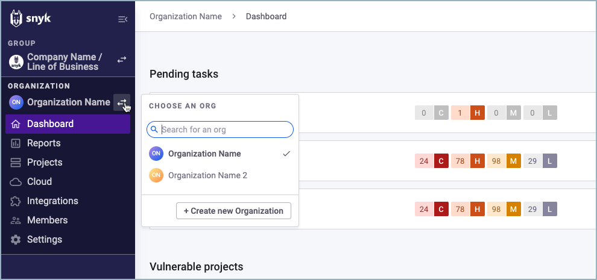

# Finding the Snyk ID and internal name of an Organization

When setting an Organization for the CLI tests, you can use either the Organization ID or the Organization's internal name. These Organization identification details are generated automatically by Snyk for each Organization upon its creation. The value you select to enter into the command, will be shown as the **Organization** name in the test results. You can find the Snyk ID and internal name on the **Settings** page of the Organization on the Web UI.

**To find an Organization ID and internal name:**

1\. On the Snyk Web UI, open the Organization whose details you want to find:

2\. Once the selected Organization is open, click the **Org Settings** button  on the top menu:

3\. On the **Settings** page of the Organization, select the **General** tab on the left. There, you can find the following Organization details:

* **Internal name:** appears in the **Organization name** section with a gray background, in the paragraph above the display name.\
  **Notes**:
  * You can change the display name of an Organization, but not the internal name.
  * The internal name also appears in the URL of the Organization.
  * When using the internal name for setting the Organization for the CLI tests, copy the name from the **Settings** page. The internal name is always written in lowercase letters.
* **ID:** appears in the **Organization ID** section. You can use the **Copy** button to copy the ID to the CLI.

